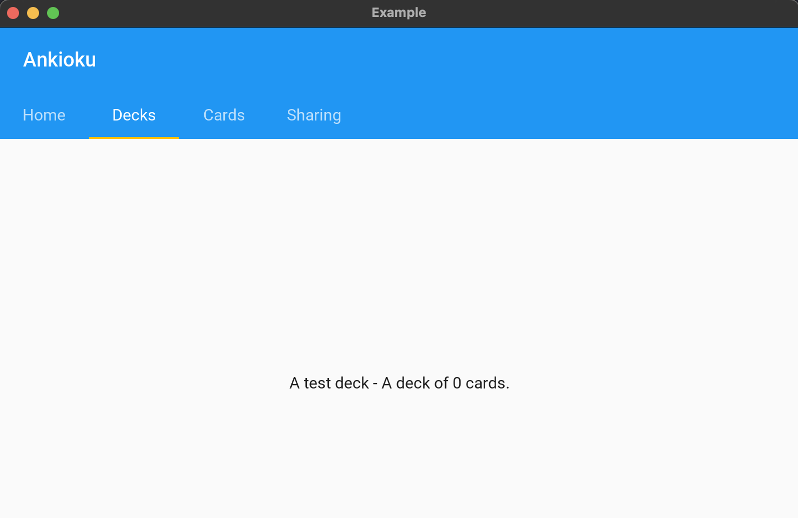

# ankioku

An Anki-like, memory enhancement tool utilizing a flash card approach to beat the forgetting curve.

## Getting started

This is a work in progress.  This section will be filled out as more features are added.

## Current status

## Contributions

I'm open to PRs, but for the time being I'm working to introduce basic concepts into the repo as well as a generic interface via Kivy to play around with.  I'll most likely be hosting a serverless version in AWS.
